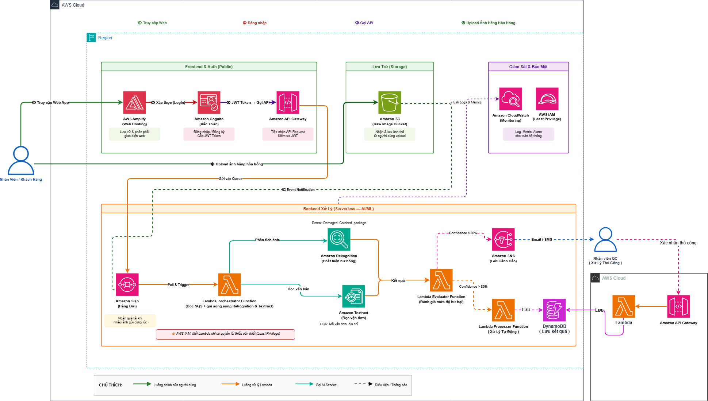

# Solution for Automated Quality Monitoring of Goods Based on Serverless and AI/ML

### Executive Summary

In the Logistics sector, businesses are under significant pressure in terms of processing time, data accuracy, and the ability to control cargo loss. Currently, quality monitoring of goods in warehouses still largely relies on humans, leading to slow incident handling, fragmented data, and difficulty updating in real time.

The team proposes building the system "Automated Solution for Goods Quality Monitoring Based on Serverless Architecture and Artificial Intelligence (AI/ML)". This is a software system that uses Amazon Web Services (AWS) services, allowing delivery staff or customers to take photos of damaged packages such as torn, broken, dented, or otherwise damaged goods, and then upload the images directly to the system for automatic analysis.

The system uses AI/ML to identify the extent of damage, extract shipment information, store evidence, and send alerts to relevant departments. As a result, the incident handling process can be shortened from several hours or days to just a few seconds, while helping the business reduce operating costs, minimize manual errors, and improve service quality.

---

### Problem Statement

#### Current Problem

Based on real-world surveys, recording and handling damaged goods today faces many process issues:

- **Manual process, time-consuming and prone to errors:** When damage is detected, staff often have to take photos with personal phones, send them through chat groups, or create paper forms. The review team then has to consolidate this scattered information to re-enter it into the ERP system and process refund procedures for customers. This process takes a lot of time and often causes data confusion.

- **Lack of automation and immediate alerts:** Because there is no software to automatically analyze images and read shipment information, warehouse managers often do not know the extent of damage immediately enough to make timely decisions. Slow response affects customer experience and service reputation.

- **Lack of system scalability:** During peak seasons, the volume of goods arriving at warehouses increases sharply. Manual inspection processes cannot handle many orders in parallel, leading to overload, missed damaged goods, or defective products continuing to reach consumers.

- **Fragmented data storage and difficult retrieval:** Existing incident records may be scattered across notebooks, Excel files, or chat groups. When needing to report monthly/quarterly loss rates to senior management, staff must review everything manually, which is time-consuming and prone to errors.

- **High operating costs:** Businesses must maintain dedicated staff at each warehouse location for inspection, data entry, and incident handling. In addition to labor costs, information errors and prolonged compensation disputes also reduce profitability and the reputation of logistics businesses.

---

### Proposed Solution

The team proposes building an automated system for monitoring goods quality based on Serverless architecture and AI/ML. The system focuses on the following core capabilities:

- **Intelligent AI automation:** The system uses Amazon Rekognition to analyze images of goods and detect signs of damage. The analysis results can include status labels, damage severity, and confidence scores. Amazon Textract is used to extract tracking numbers, addresses, or related text information from images without manual entry.

- **Asynchronous processing in real time:** After images are uploaded to Amazon S3, they trigger an automated processing workflow. Image data, tracking numbers, and analysis results are synchronized to Amazon DynamoDB for search, statistics, and report generation. This processing approach helps reduce recording and response times from days to just a few seconds.

- **Automatically scalable Serverless infrastructure:** The system runs on AWS Serverless services, which can scale automatically when the number of images increases suddenly during peak periods. The business does not need to manage servers manually while still ensuring the ability to process many requests at once.

- **Centralized and transparent data management:** All scan history, evidence images, tracking numbers, and processing statuses are stored centrally. Managers can retrieve history at any time, review evidence, and export statistical reports on damaged goods.

- **Optimization of operating costs:** Integrating AI into the workflow helps reduce errors compared to manual entry, reduce the need for specialized staff at each warehouse, shorten dispute resolution time, and improve reliability in compensation handling.

---

### Solution Architecture

#### Overall Architecture

The system is designed according to an event-driven architecture model, using AWS services to scale automatically according to actual traffic. The entire lifecycle of a goods quality monitoring request is divided into 4 main technology layers:

| Architecture Layer | Role | Proposed AWS Services |
| --- | --- | --- |
| Frontend & Auth | Provide a web interface, manage login/registration, issue JWT Tokens, and control API access permissions | AWS Amplify, Amazon Cognito, Amazon API Gateway |
| Storage | Receive and store images of damaged goods uploaded by users | Amazon S3 |
| Backend & AI/ML | Process image upload events, analyze images, extract shipment information, assess damage severity, and update data | Amazon SQS, AWS Lambda, Amazon Rekognition, Amazon Textract, Amazon DynamoDB |
| Monitoring & Security | Monitor system activity, manage logs, and enforce least-privilege access | Amazon CloudWatch, AWS IAM |

#### Main Processing Flow

| Step | Description |
| --- | --- |
| 1 | The user logs in to the system through the web interface deployed with AWS Amplify and authenticated by Amazon Cognito. |
| 2 | The user uploads an image of a damaged package to the system. The image is stored in the Amazon S3 Raw Image Bucket. |
| 3 | An S3 Event Notification is triggered after the image is uploaded successfully and sends processing information to Amazon SQS. |
| 4 | The Lambda orchestrator-function reads the event from SQS, then calls Amazon Rekognition to detect damage and Amazon Textract to read tracking numbers/text information. |
| 5 | The Lambda evaluator-function assesses damage severity based on AI/ML results and determines the processing status. |
| 6 | The Lambda processor-function stores the results in Amazon DynamoDB, updates the record status, and triggers alerts if needed. |
| 7 | Amazon SNS sends Email/SMS notifications to warehouse managers or the processing team when a serious incident is detected. |
| 8 | Amazon CloudWatch records logs, metrics, and supports error monitoring throughout the entire operation. |

---

### AWS Services Used

#### Frontend & Auth

- **AWS Amplify:** Hosts and distributes the web interface for users.
- **Amazon Cognito:** Manages login, registration, and JWT Token issuance.
- **Amazon API Gateway:** Receives API requests, validates tokens, and forwards requests to the backend.

#### Storage

- **Amazon S3:** Stores original images of goods, acting as the intake point for incoming data.

#### Backend Serverless & AI/ML

- **Amazon SQS:** Acts as an intermediate queue to help the system process asynchronously and avoid overload when many images are uploaded at the same time.
- **AWS Lambda orchestrator-function:** Reads events from SQS and orchestrates AI/ML analysis tasks.
- **Amazon Rekognition:** Analyzes images to detect signs of damage in packages.
- **Amazon Textract:** Extracts text, tracking numbers, or shipment information from images.
- **AWS Lambda evaluator-function:** Evaluates damage severity and classifies processing status.
- **AWS Lambda processor-function:** Saves results, updates records, and triggers subsequent processing steps.
- **Amazon DynamoDB:** Stores analysis results, processing history, order status, and data for reporting.
- **Amazon SNS:** Sends Email/SMS alerts to relevant departments.

#### Monitoring & Security

- **Amazon CloudWatch:** Monitors logs, metrics, error alerts, and system performance.
- **AWS IAM:** Manages access permissions according to the least privilege principle, ensuring each service only has the necessary permissions to operate.

---

### Risk Assessment

| Risk | Impact | Mitigation |
| --- | --- | --- |
| Poor input image quality | AI may misidentify or fail to extract tracking numbers | Guide users to take clear, well-lit photos; check image format and size before upload |
| AI/ML results are not fully accurate in some cases | May misclassify damage severity | Allow managers to confirm manually for cases with low confidence |
| High traffic during peak seasons | The system may experience delays if queues are not managed well | Use SQS to regulate load, Lambda to scale automatically, and CloudWatch to monitor backlog |
| Leakage of image data or shipment information | Impacts customer data security | Apply Cognito, least-privilege IAM, S3 access control, and encrypt data at rest |
| Costs increase if processing a very large number of images | Affects the operating budget | Monitor usage with CloudWatch, set cost alerts, and optimize image size before analysis |

---

### Expected Results

- Reduce the time to record and handle incidents from several hours or days to just a few seconds.
- Automatically identify signs of damage in goods using AI, reducing dependence on manual inspection.
- Automatically extract tracking numbers and related information, reducing data entry errors.
- Centralize incident data, evidence images, and processing status in a single system.
- Support warehouse managers in retrieving history, analyzing loss rates, and quickly exporting reports.
- Improve scalability during peak seasons through a Serverless architecture.
- Reduce operating labor costs, minimize compensation disputes, and enhance the reputation of Logistics services.

---

### Conclusion

The solution for automated goods quality monitoring based on Serverless and AI/ML helps Logistics businesses transform incident handling processes from manual to automated, centralized, and scalable. The combination of Amazon S3, SQS, Lambda, Rekognition, Textract, DynamoDB, SNS, CloudWatch, and IAM creates an architecture well-suited to real-time image processing tasks while optimizing operating costs and improving customer service quality.
