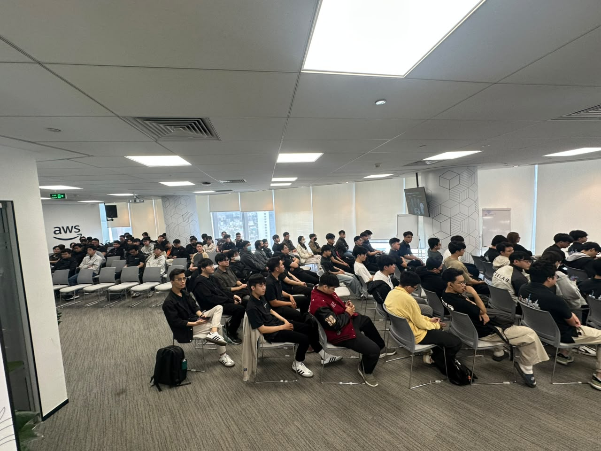
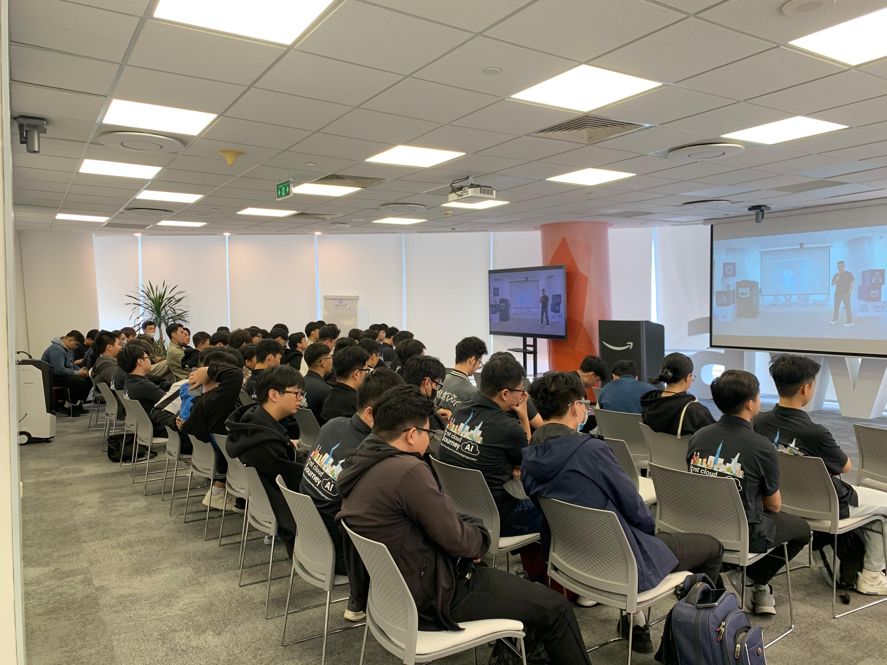

# Reflection “FCAJ Community Day”

### Event Purpose

- Share best practices for operating cloud systems with AI support
- Introduce the latest AI agent, voice agent, and DevOps agent solutions from AWS
- Guide the application of AI to operations, HR, and security system integration problems
- Connect the technology community with experts and practical solutions from AWS

### Speaker List

- **Huynh Hoang Long** - Event host
- Together with guest speakers from AWS and the technology community:
- **Truong Tran** - AI Solution Sales, Noventiq
- **Steve Tran** - CTO/Founder, CloudThinker
- **Trung Vu** - CEO, Revve AI
- **Anh Dang** - Solution Sales, Noventiq
- **Nghi Danh** - AI Engineer, Renova Cloud
- **Kiet Tran** - AI Engineer, AWS Student Builder Group
- **Bao Phan** - Cloud Engineer, Cloud Kinetics
- **Nguyen Nguyen** - Cloud Engineer, Cloud Kinetics
- **Toan Nguyen** - AWS Security Builder

### Key Highlights

#### Deep Response Engine: From Detection to Autonomous Resolution

- The complex wall in modern cloud operations
- The shift from alert-driven systems to action-driven systems
- Overview of the Deep Response Engine architecture
- Direct demo of autonomous incident response
- Business impact: reduced costs and zero-downtime operations

#### Voice Agents: Building Human-Like AI Conversations at Scale

- The evolution from IVR, chatbots, to AI voice agents
- Main challenges: latency, accuracy, and natural interaction
- Amazon Nova Sonic and the underlying speech-to-speech foundation model
- Architecture: telephony, streaming, Bedrock, MCP tools
- Enterprise use cases, best practices, and live demo

#### AWS DevOps Agent: Your Always-Available Operations Teammate

- Overview of the AWS DevOps Agent
- Reduce MTTD and MTTR through AI-driven operations
- Support for multi-cloud and hybrid environments
- Bedrock AgentCore and the multi-agent reasoning approach
- Real-world use cases and deployment demo on ECS

#### AI-Powered Productivity: Workforce Planning For Enterprise

- Digital transformation challenges in HR in modern enterprises
- Overview of Amazon Quick and its features for HR
- Accelerate HR operations through automation
- Workforce analysis and insight based on data
- Strategic workforce planning for business decisions

#### Building Secure Private MCP Connection with Amazon Quick

- Introduce Amazon Quick as an AI assistant platform
- MCP (Model Context Protocol) and its role in scalability
- Security challenges in MCP-based integration
- Configuring private connections (VPC) for Amazon Quick
- Demo and practical deployment experience

### What I Learned

#### Operating Systems with AI

- **From alert-driven to action-driven**: understanding how modern systems are shifting from merely warning to automatically handling incidents
- **Reducing MTTD/MTTR**: learning how AI agents help shorten detection and response times for operational incidents
- **Multi-cloud and hybrid**: understanding how AI operations solutions can be applied across multiple environments

#### Voice Agents and AI Communication

- **Speech-to-speech foundation model**: learning about Amazon Nova Sonic and the architecture behind voice agents
- **Challenges of latency and accuracy**: identifying the technical factors to consider when building natural conversational experiences
- **Integration architecture**: how telephony, streaming, Bedrock, and MCP tools work together

#### AI Applications in HR and Security

- **Amazon Quick for HR**: how automation and data analysis help accelerate workforce operations
- **Security in MCP**: understanding the challenges and how to configure private connections (VPC) when integrating AI assistants into enterprise systems

### Application to Work

- **Apply action-driven thinking**: consider shifting some current alert-driven processes to automatic incident handling
- **Test voice agents**: evaluate the applicability of Amazon Nova Sonic for customer service use cases
- **Integrate the DevOps Agent**: pilot AWS DevOps Agent to support current system operations
- **Apply Amazon Quick to HR**: propose testing workforce analytics features for HR operations
- **Emphasize MCP security**: reference VPC private connectivity configuration when integrating AI assistants into internal systems

### Experience in the Event

Participating in “FCAJ Community Day” was a valuable experience that helped me stay up to date with the latest AI solutions for system operations, voice interaction, and HR management. Some of the most memorable experiences were:

#### Learning from highly experienced speakers
- Listening directly to experts discuss **Deep Response Engine** and how modern systems automate incident handling.
- Through live demos, I gained a clearer understanding of how **AWS DevOps Agent** supports operations teams in reducing detection and recovery time.

#### Practical technical experience
- Learning about **Amazon Nova Sonic** and the architecture behind building voice agents that can converse naturally at scale.
- Exploring how **Amazon Quick** supports workforce planning and HR data analysis.
- Gaining a clearer understanding of how to configure **private MCP connections (VPC)** to ensure security when integrating AI assistants.

#### Applying modern tools
- Directly learning about the **Bedrock AgentCore** architecture and the multi-agent reasoning approach in operations.
- Recognizing the potential of applying AI agent solutions to reduce repetitive work for operations and HR teams.

#### Connection and exchange
- The event created opportunities to exchange ideas directly with speakers and the technology community about real-world AI agent solutions.
- Through the demos, I gained more perspective on how to deploy AI agents safely and effectively in enterprises.

#### Lessons learned
- Moving from alert-driven to action-driven operations helps reduce downtime and improve incident response efficiency.
- Voice agents and AI assistants are becoming increasingly important in customer experience and internal operations.
- Security must be prioritized when integrating AI agents through MCP into enterprise systems.

#### Some photos from the event
* Add photos of your friends here

> Overall, the event not only provided technical knowledge about AI agents and cloud operations, but also gave me more ideas for applying AI to my current work in a more effective and safer way.
