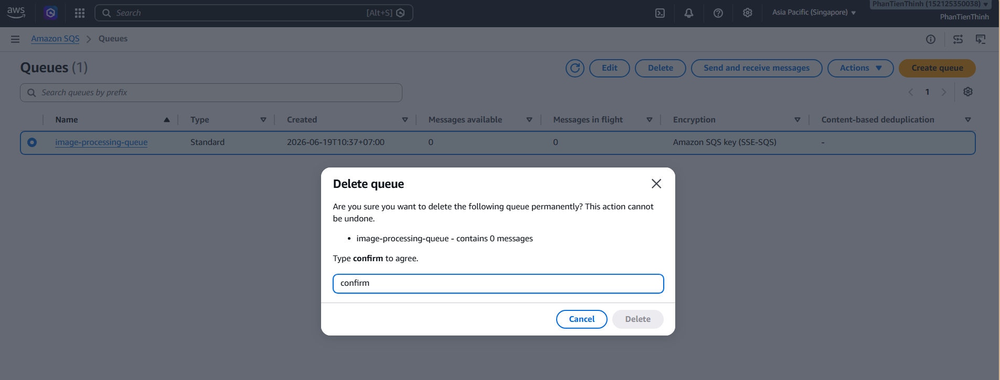
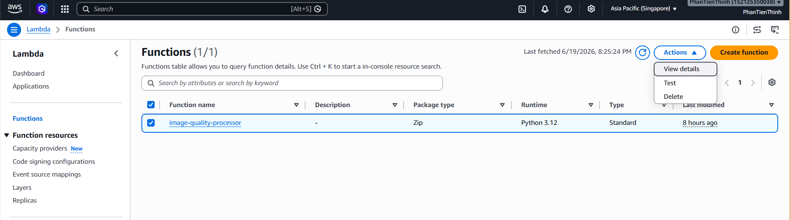

# (VI) Bước 6: Cleaning Up Resources

### Objective

Sau khi hoàn thành workshop, bạn cần xóa các tài nguyên đã tạo để tránh phát sinh chi phí.

---

### 1. Xóa SQS Queue

1. Truy cập **Amazon SQS**.

2. Chọn queue tạo trong workshop, sau đó chọn **Delete**.

3. Nhập **Confirm** để xác nhận xóa queue.

---

### 2. Xóa Lambda Function

1. Truy cập **AWS Lambda**.

2. Chọn function đã tạo trong workshop, sau đó chọn **Delete**.

3. Nhập xác nhận để xóa function.

---

### 3. Xóa S3 Bucket

1. Truy cập **Amazon S3**.

2. Vào bucket đã tạo.

3. Chọn bucket và chọn **Delete**.

Lưu ý: Bucket phải trống trước khi xóa. Nếu còn object, hãy xóa hết trước.

---

### 4. Xóa IAM Role

1. Truy cập **IAM**.

2. Chọn **Roles**.

3. Chọn IAM Role **Lambda-ImageProcessing-Role** đã tạo ở bước 1, sau đó xóa role.

